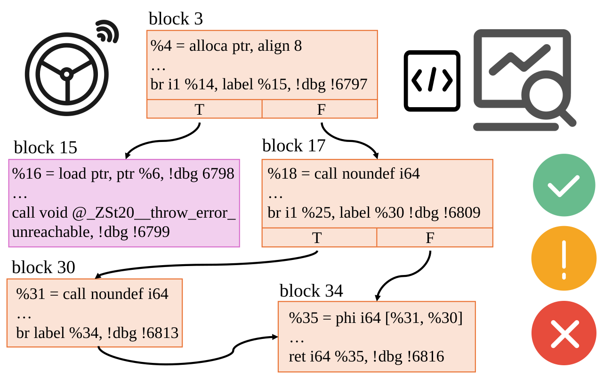
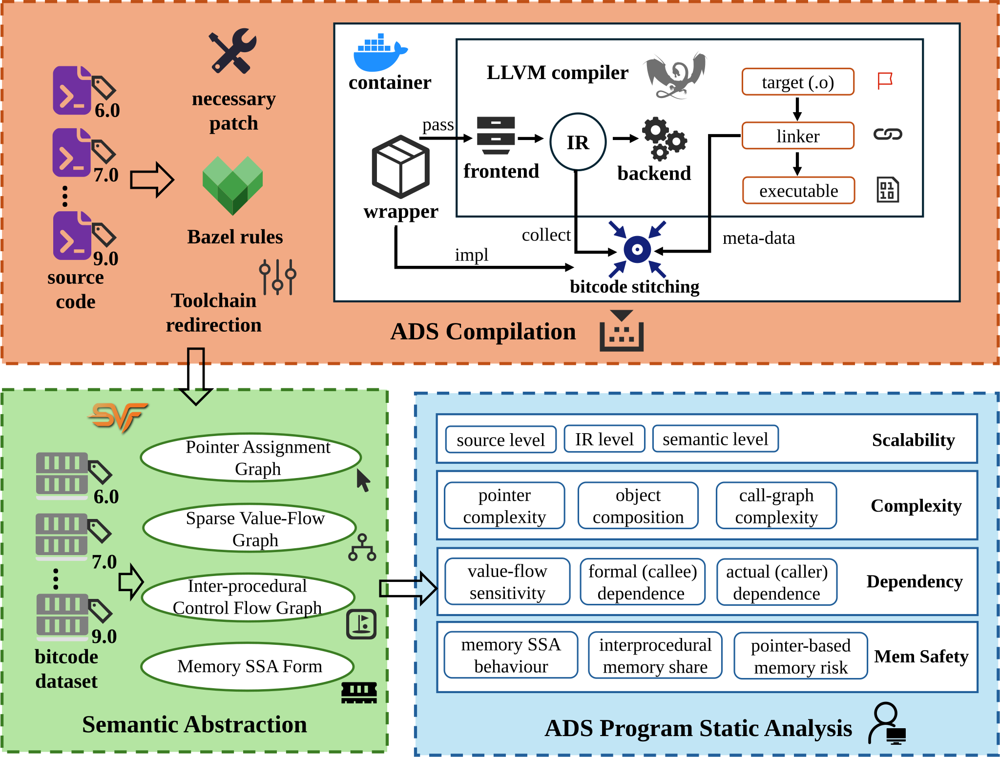
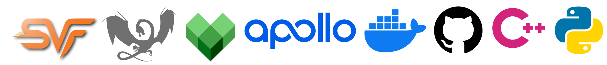

# AVIR

[](https://www.gnu.org/licenses/gpl-3.0)
[](https://doi.org/10.5281/zenodo.22011115)
[](https://avir.readthedocs.io/en/latest/)
[](https://github.com/avirstatic/AVIR/releases)

## Overview

**AVIR** is a static program analysis and understanding framework for industrial-scale autonomous driving systems (ADSs), Baidu Apollo. It centrally manages the ADS source code of four Apollo versions (6.0-9.0) and, through lightweight modifications to the Bazel toolchain, redirects the build process to an LLVM-based [[2](#ref2)] wllvm wrapper so that the ADSs’ intermediate representation (IR) can be automatically collected without disrupting the original build workflow.

<div align="center">
  
</div>

Building on the extracted LLVM bitcode, **AVIR** leverages an LLVM IR parsing toolchain and the Static Value-Flow (SVF) [[1](#ref1)] framework to perform ADS program analysis, extracting statistical metrics at both the source-code and IR levels, and thereby deriving structural characteristics and evolutionary insights across ADS versions and modules.

## Features

The workflow of **AVIR** is shown below.

<div align="center">
  
</div>

## Prerequisites

### Hardware

- Intel Core i9 12900K (16-core) and above

- 96 GB memory and above

- **No GPU is required**

### Software

- Ubuntu 18.04 and above

- Python 3.12 and above

## QuickStart

### Install AVIR

```bash
pip install -r requirements.txt
```

### Analyze One Version of Baidu Apollo

Choose one Apollo version to be analyzed, all scripts below accept one version argument:

- `6` / `7` / `8` / `9`

Example used in this tutorial: `9`, please follow the subsections **in order**.

> For the input/output and processing workflow of each script, please click the corresponding script’s documentation hyperlink for details.

#### 1. Extract Apollo bitcode

Use [extract.py](docs/source/api/scripts/extract.rst) to clone/compile Apollo using LLVM and collect whole-program bitcode:

```bash
python extract.py 9
```

Expected results:

- Apollo source code for `apollo9` is prepared under project workspace `PROJECT_ROOT`.

- Bitcode artifacts are generated in `apollo9/wllvm_bc/` for downstream IR-level and abstract semantic analysis.

#### 2. Mapping bitcode-to-source

Use [name_mapping.py](docs/source/api/scripts/name_mapping.rst) to generate hash-name mapping.

```bash
python name_mapping.py 9
```

Expected results: `results/bc_mapping_v9.json`

#### 3. Source-level statistics

- Use [source_statistic.py](docs/source/api/scripts/source_statistic.rst) to get the source-code level data:

```bash
python source_statistic.py 9
```

Expected results: `results/source_statistic_v9.csv`

#### 4. IR-level statistics

Use [ir_statistic.py](docs/source/api/scripts/ir_statistic.rst) to get the IR level data:

```bash
python ir_statistic.py 9
```

Expected results: `results/ir_statistic_v9.csv`

#### 5. Run Saber analysis

Use [saber_analyze.py](docs/source/api/scripts/saber_analyze.rst) to call Saber static analysis on each bitcode:

```bash
python saber_analyze.py 9
```

Expected results: `results/saber_json_v9/` (JSON file per bitcode)

#### 6. Abstract semantic statistics

Use [semantic_statistic.py](docs/source/api/scripts/semantic_statistic.rst), then choose one field-group index interactively:

```bash
python semantic_statistic.py 9
```

Expected results: `results/semantic_statistic_{FIELD}_v9.csv`

### Summary

Miminal command chain, choose a version from `6` / `7` / `8` / `9`:

e.g. `9` for quick copy-and-run:

```bash
python extract.py 9
python name_mapping.py 9
python source_statistic.py 9
python ir_statistic.py 9
python saber_analyze.py 9
python semantic_statistic.py 9
```
> **[WARNING]** Do not change the execution order in one version’s analysis pipeline!

**Troubleshooting**: See [FAQ](docs/source/faq.rst) page in the AVIR documentation.

## Documentation
We provide detailed documentation under `docs/`. You can build it with [Sphinx](https://www.sphinx-doc.org/en/master/): after installing dependencies from `requirements.txt`, run the following command from the project root:

```bash
sphinx-build docs/source docs/build
```

To view the generated docs, open the entry page in your browser from the project root:

```bash
open docs/build/index.html
```

## Acknowledgments

This framework was inspired by and/or reuse the following artifacts. We thank the organizations and authors for their contributions.

- SVF [[1](#ref1)]: [https://github.com/SVF-tools/SVF](https://github.com/SVF-tools/SVF)

- cloc: [https://github.com/AlDanial/cloc](https://github.com/AlDanial/cloc)

- LLVM [[2](#ref2)]: [https://github.com/llvm/llvm-project](https://github.com/llvm/llvm-project)

- whole-program-llvm: [https://github.com/travitch/whole-program-llvm](https://github.com/travitch/whole-program-llvm)

- AVGuardian [[3](#ref3)]: [https://github.com/analyzerav/avguardian](https://github.com/analyzerav/avguardian)

- PlanFuzz [[4](#ref4)]: [https://github.com/ASGuard-UCI/PlanFuzz](https://github.com/ASGuard-UCI/PlanFuzz)

- AVChecker [[5](#ref5)]: [https://github.com/zqzqz/AVChecker](https://github.com/zqzqz/AVChecker)

<div align="center">
  
</div>

**References**

<a name="ref1">[1]</a> Yulei Sui and Jingling Xue. 2016. SVF: interprocedural static value-flow analysis in LLVM. In Proceedings of the 25th International Conference on Compiler Construction (CC ‘16). Association for Computing Machinery, New York, NY, USA, 265–266. [https://doi.org/10.1145/2892208.2892235](https://doi.org/10.1145/2892208.2892235)

<a name="ref2">[2]</a> Chris Lattner and Vikram Adve. 2004. LLVM: A Compilation Framework for Lifelong Program Analysis & Transformation. In Proceedings of the international symposium on Code generation and optimization: feedback-directed and runtime optimization (CGO ‘04). IEEE Computer Society, USA, 75. [https://dl.acm.org/doi/10.5555/977395.977673](https://dl.acm.org/doi/10.5555/977395.977673)

<a name="ref3">[3]</a> David Ke Hong, John Kloosterman, Yuqi Jin, Yulong Cao, Qi Alfred Chen, Scott Mahlke, and Z. Morley Mao. 2020. AVGuardian: Detecting and Mitigating Publish-Subscribe Overprivilege for Autonomous Vehicle Systems. In 2020 IEEE European Symposium on Security and Privacy (EuroS&P). IEEE, 445-459. [https://doi.org/10.1109/EuroSP48549.2020.00035](https://doi.org/10.1109/EuroSP48549.2020.00035)

<a name="ref4">[4]</a> Ziwen Wan, Junjie Shen, Jalen Chuang, Xin Xia, Joshua Garcia, Jiaqi Ma, and Qi Alfred Chen. 2022. Too Afraid to Drive: Systematic Discovery of Semantic DoS Vulnerability in Autonomous Driving Planning under Physical-World Attacks. arXiv preprint arXiv:2201.04610. [https://arxiv.org/abs/2201.04610](https://arxiv.org/abs/2201.04610)

<a name="ref5">[5]</a> Qingzhao Zhang, David Ke Hong, Ze Zhang, Qi Alfred Chen, Scott Mahlke, and Z. Morley Mao. 2022. A Systematic Framework to Identify Violations of Scenario-dependent Driving Rules in Autonomous Vehicle Software. SIGMETRICS Perform. Eval. Rev. 49, 1 (June 2021), 43-44. [https://doi.org/10.1145/3543516.3460101](https://doi.org/10.1145/3543516.3460101)
